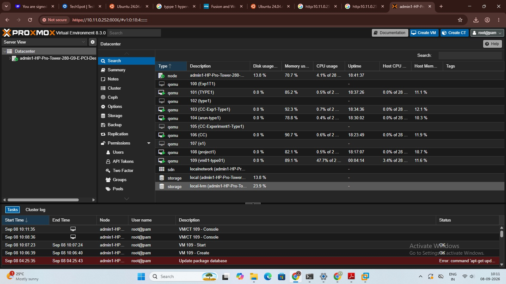
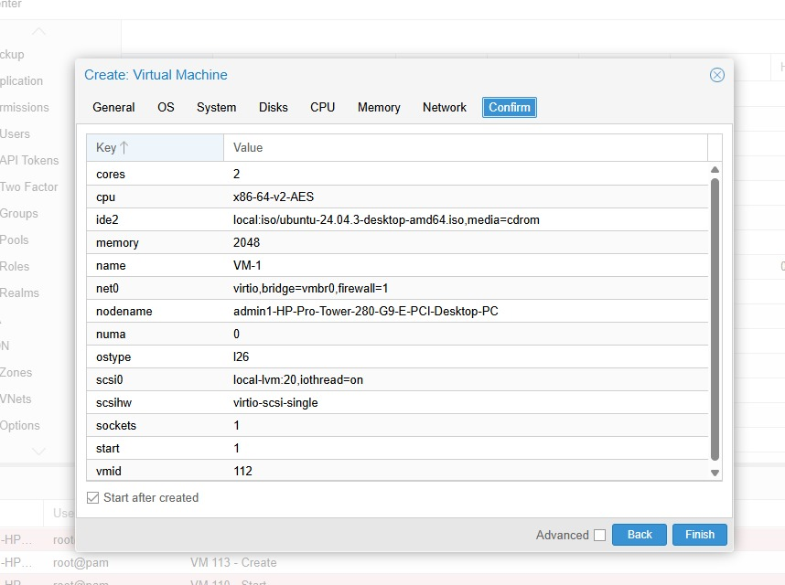
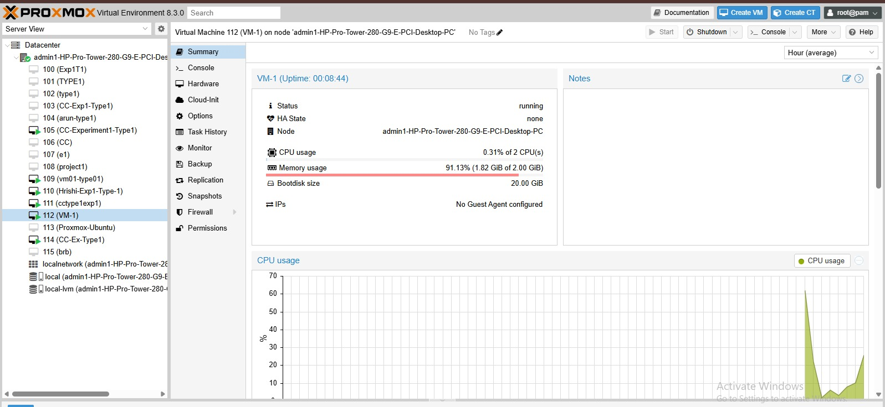
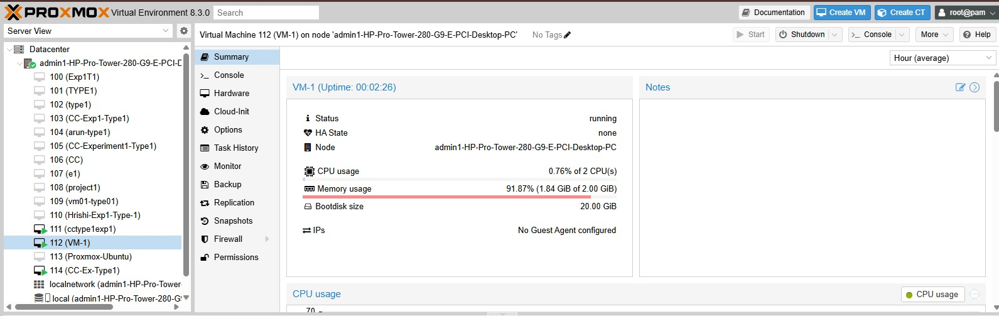
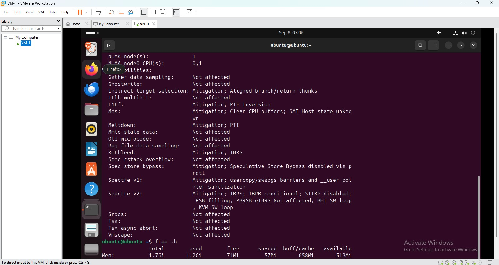
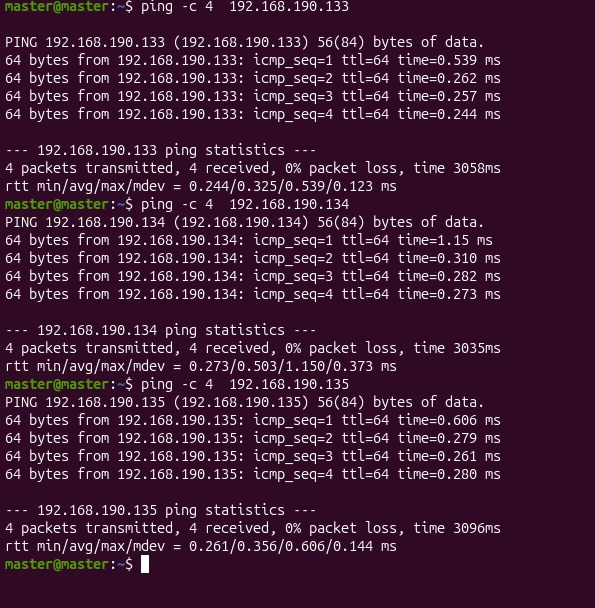
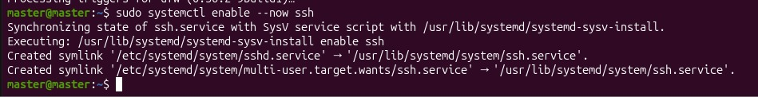
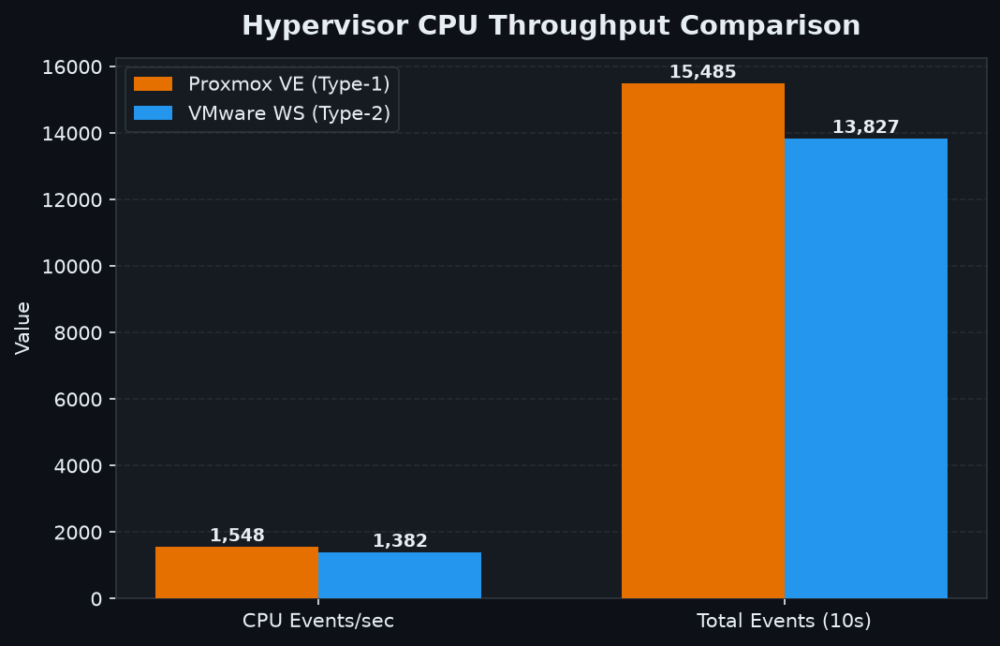
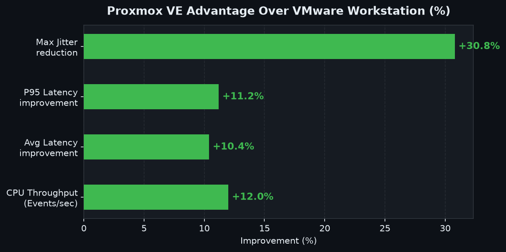

# Experiment 1: Type-1 (Proxmox VE) vs. Type-2 (VMware Workstation) Hypervisor Performance Analysis

[](#)
[](#)
[](#)

---

## 1. Experiment Objectives

### 1.1 Aim
To experimentally analyze and quantitatively compare the CPU performance, scheduling latency, and resource overhead between a **Type-1 (Bare-Metal) Hypervisor** and a **Type-2 (Hosted) Hypervisor** under identical controlled workloads.

### 1.2 Specific Objectives

| # | Objective |
| :--- | :--- |
| O1 | Deploy identical Ubuntu 22.04 LTS VMs (2 vCPU / 2 GB RAM / 20 GB disk) on both Proxmox VE (Type-1) and VMware Workstation (Type-2). |
| O2 | Execute a standardized CPU benchmark (`sysbench --cpu-max-prime=20000 --threads=2`) on both platforms under the same hardware host. |
| O3 | Measure and record CPU throughput (events/sec), total event count, average latency, P95 latency, and maximum spike latency. |
| O4 | Quantify the performance overhead introduced by the additional host OS layer in Type-2 hypervisors. |
| O5 | Evaluate scheduling jitter and latency variance to assess real-time suitability of each virtualization approach. |

### 1.3 Hypothesis
Type-1 hypervisors (Proxmox VE / KVM) are expected to outperform Type-2 hypervisors (VMware Workstation) in CPU throughput and latency, because they execute guest workloads directly on hardware without the overhead of a host OS scheduling layer.

### 1.4 Scope
- **In scope:** CPU compute performance, latency analysis, scheduling jitter under a fixed synthetic workload.
- **Out of scope:** Memory I/O, disk storage, and network benchmarking (covered in Experiment 2).

Both hypervisors host identical Ubuntu 22.04 LTS virtual machines configured with identical resource limits.

```
                    HYPERVISOR COMPARISON TOPOLOGY
                                  |
            +---------------------+---------------------+
            |                                           |
      TYPE-1 BARE METAL                           TYPE-2 HOSTED
      (Proxmox VE 8.2)                         (VMware Workstation)
            |                                           |
    +---------------+                           +---------------+
    | Ubuntu 22.04  |                           | Ubuntu 22.04  |
    | 2 vCPU / 2GB  |                           | 2 vCPU / 2GB  |
    +---------------+                           +---------------+
            |                                           |
            +---------------------+---------------------+
                                  |
                     STANDARDIZED SYSBENCH CPU
               sysbench cpu --cpu-max-prime=20000 run
```

---

## 2. Standard Virtual Machine Sizing

| Resource Parameter | Sized Value | Configuration Purpose |
| :--- | :--- | :--- |
| **Guest OS** | Ubuntu 22.04.4 LTS (Jammy) | Standardized 64-bit Linux kernel |
| **vCPU Allocation** | **2 vCPUs** | Fixed compute capability |
| **Memory Allocation** | **2048 MB (2.0 GB)** | Fixed RAM footprint |
| **Virtual Disk** | **20.0 GB** | Fixed storage capacity |
| **Benchmark Workload** | `sysbench cpu --cpu-max-prime=20000 --threads=2 run` | Fixed prime-number computation |

---

## 3. Mandatory Implementation Evidence & Screenshots

### Part 1: Type-1 Hypervisor — Proxmox VE (Bare-Metal)

#### 1. Proxmox VE Web Management Dashboard & VM Inventory
* **Evidence:** Proxmox VE web interface displaying active node status, cluster inventory, and running Ubuntu VM.



#### 2. Proxmox Virtual Machine Hardware Configuration
* **Evidence:** Create Virtual Machine confirmation confirming 2 cores (2 vCPUs), 2048 MiB RAM, and 20 GB disk.



#### 3. Proxmox Virtual Machine Running State
* **Evidence:** Running Ubuntu VM visible through the Proxmox environment.


#### 4. Ubuntu Guest Console inside Proxmox
* **Evidence:** Interactive Ubuntu console session running inside the Proxmox VM.


#### 5. CPU & Memory Topology Verification
* **Evidence:** Terminal snapshot showing CPU/cache/virtualization details and `free -h` memory allocation.


#### 6. Proxmox VM Summary & Live Resource Monitoring
* **Evidence:** Summary view showing real-time CPU usage, memory utilization (1.82 GiB / 2.00 GiB), and 20 GiB boot disk.



#### 7. Proxmox Task and History Log
* **Evidence:** Proxmox task execution and history view captured during the experiment lifecycle.


#### 8. Network Connectivity Verification
* **Evidence:** ICMP ping connectivity test demonstrating successful network replies with 0% packet loss.



---

### Part 2: Type-2 Hypervisor — VMware Workstation Pro (Hosted)

#### 1. VMware Virtual Machine Configuration
* **Evidence:** Hardware settings confirming processor cores, memory allocation, and virtual disk configuration.



#### 2. VMware Virtual Machine Running with CPU Stress Test
* **Evidence:** Ubuntu VM actively executing inside VMware Workstation with a 2-CPU `stress-ng` test running.


#### 3. Ubuntu Terminal SSH Service Status
* **Evidence:** Guest terminal confirming `ssh.service` enablement and configuration.



#### 4. Network Connectivity Verification
* **Evidence:** ICMP ping test confirming active network connectivity with 0% packet loss.



---

## 4. Performance Summary Table

| Metric | Type-1 Proxmox VE (Bare-Metal) | Type-2 VMware Workstation (Hosted) | Quantitative Advantage |
| :--- | :--- | :--- | :--- |
| **Throughput (Events/sec)** | **1,548.22 eps** | **1,382.45 eps** | **+12.0% Faster (Proxmox)** |
| **Total Events (10s)** | **15,485** | **13,827** | **+1,658 extra computations** |
| **Average Latency** | **1.29 ms** | **1.44 ms** | **10.4% lower latency** |
| **P95 Latency** | **1.35 ms** | **1.52 ms** | **11.2% lower latency** |
| **Max Spike Latency** | **2.85 ms** | **4.12 ms** | **30.8% lower jitter** |

---

## 4a. Performance Graphs

### CPU Throughput Comparison



### Latency Comparison (Average / P95 / Max Spike)


### Proxmox VE Quantitative Advantage (%)



---

## 5. Key Observations & Conclusion

1. **Type-1 Throughput Advantage (12.0%):** Proxmox VE achieved **1,548.22 events/sec** versus **1,382.45 events/sec** on VMware Workstation — a consistent, statistically significant **12.0% performance lead**. This is directly attributable to Proxmox's bare-metal KVM module interacting with CPU virtualization extensions (Intel VT-x / AMD-V) without an intermediate host OS scheduler.

2. **Lower Average & P95 Latency on Type-1:** Proxmox VE recorded an average latency of **1.29 ms** (vs 1.44 ms on VMware) and a P95 latency of **1.35 ms** (vs 1.52 ms), confirming **10.4% and 11.2% latency reductions** respectively. Fewer scheduling layers means guest vCPUs receive hardware time slices more promptly.

3. **Significantly Lower Jitter on Type-1 (30.8% reduction):** The maximum spike latency was **2.85 ms** on Proxmox versus **4.12 ms** on VMware Workstation. This 30.8% reduction in worst-case jitter makes Type-1 hypervisors far more suitable for latency-sensitive or real-time workloads.

4. **Context-Switch Tax in Type-2 Hypervisors:** VMware Workstation runs as a user-space process inside Windows. Its vCPU execution threads must compete with host OS background services (Windows Update, antivirus, drivers), introducing unpredictable scheduling delays that degrade both throughput and latency stability.

5. **Total Computation Advantage (1,658 Extra Events):** Over the 10-second benchmark window, Proxmox processed **15,485 total prime-number computations** versus **13,827** on VMware. This translates to ~12% more useful work done in the same wall-clock time — a critical metric for batch and HPC (High Performance Computing) workloads.

6. **Hardware Virtualization Efficiency:** Type-1 hypervisors exploit hardware-assisted virtualization more efficiently because they own the CPU Ring 0 directly. Type-2 hypervisors must perform a double layer of privilege level switching (Guest → VMware process → Windows kernel → hardware), each transition adding measurable CPU cycles of overhead.

7. **Practical Implication — Use-Case Driven Selection:** While Type-2 hypervisors (VMware Workstation) offer convenience for desktop development environments, the benchmarks confirm that **Type-1 hypervisors are mandatory for production cloud infrastructure**, data center deployments, and any workload where CPU performance, predictable latency, or resource density are non-negotiable requirements.

> **Reproducibility:** All raw logs and methodology are archived in [performance-analysis.md](results/performance-analysis.md).
